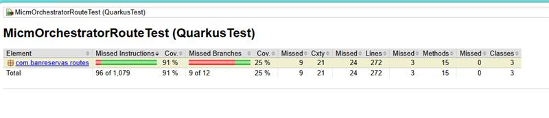

# ms-orq-master-registro-inscripcion-micm
Este proyecto es un microservicio Json funcionando como orquestador encargado de consumir el servicio **MASTERREGISTROINSCRIPCIONMICM** y **LOGINMICM** de legado.

Si quieres aprender más de Quarkus, por favor visita el [sitio web oficial](https://quarkus.io/).

## Ejecución de la aplicación en modo de desarrollo

Puedes ejecutar tu aplicación en modo de desarrollo, lo que permite la codificación en vivo, utilizando el siguiente comando:

```shell script
./mvnw compile quarkus:dev
```

> **_NOTA:_**  Quarkus incluye una interfaz Dev UI que está disponible solo en modo de desarrollo en http://localhost:8080/q/dev/.

## Empaquetado y ejecución de la aplicación

La aplicación se puede empaquetar utilizando:

```shell script
./mvnw package
```
Este comando genera el archivo quarkus-run.jar en el directorio target/quarkus-app/. Ten en cuenta que no es un über-jar, ya que las dependencias se copian en el directorio target/quarkus-app/lib/.

La aplicación se puede ejecutar utilizando:

```shell script
java -jar target/quarkus-app/quarkus-run.jar
```
Si deseas construir un über-jar, ejecuta el siguiente comando:

```shell script
./mvnw package -Dquarkus.package.jar.type=uber-jar
```

La aplicación empaquetada como un über-jar se puede ejecutar utilizando:

```shell script
java -jar target/*-runner.jar
```

## Creación de un ejecutable nativo

Puedes crear un ejecutable nativo utilizando:

```shell script
./mvnw package -Dnative
```

O, si no tienes GraalVM instalado, puedes construir el ejecutable nativo en un contenedor utilizando:

```shell script
./mvnw package -Dnative -Dquarkus.native.container-build=true
```

Luego, puedes ejecutar tu ejecutable nativo con:

```shell script
./target/ms-orq-master-registro-inscripcion-micm-1.0.0-SNAPSHOT-runner
```

Para obtener más información sobre cómo construir ejecutables nativos, consulta https://quarkus.io/guides/maven-tooling.

## Guías Relacionadas

- **Quarkus CXF:** Capacidades principales para implementar clientes SOAP y servicios JAX-WS.
- **RESTEasy Reactive:** Implementación de Jakarta REST utilizando procesamiento en tiempo de compilación y Vert.x.
- **SmallRye OpenTracing:** Trazado de servicios con SmallRye OpenTracing.
- **SmallRye OpenAPI:** Documenta tus APIs REST con OpenAPI, incluye Swagger UI.
- **Jacoco - Cobertura de Código:** Soporte para cobertura de pruebas con Jacoco.
- **SmallRye Health:** Monitorea la salud de tu aplicación usando SmallRye Health.
- **Micrometer Metrics:** Instrumenta el tiempo de ejecución y tu aplicación con métricas dimensionales usando Micrometer.

## Endpoints

**POST:** registration/micm/api/v1/registrationInscription

**Descripción:** Este endpoint permite registrar los registros de embargos y garantías.

**GET:** /registration/micm/api/v1/health

**Descripción:** Monitorea la salud de tu aplicación utilizando SmallRye Health.

**GET:** /registration/micm/api/v1/swagger-ui

**Descripción:** Para acceder a Swagger UI y ver la documentación de las apis.

**Códigos de Respuesta:**

    200 OK - Exitoso: Éxito en la operación.
    400 Bad Request - BAD_REQUEST: Solicitud incorrecta.
    401 Unauthorized - UNAUTHOTIZE: No autorizado.
    500 Internal Server Error - INTERNAL_SERVER_ERROR: Error interno del servidor.
    503 BAD_GATEWAY: Error de conexión al servicio.
    500 UNEXPECTED_ERROR: Error interno inesperado del servidor.

## Integración con Servicios Externos

El servicio invoca dos servicio REST llamado ms-log-in-micm y ms-cambia-estado-operacion-micmm, el de login para obtener el token para autenticarse en cambia estado operacion micm y poder realizar embargos, ejecuciones y cancelaciones.

##### Variables de Entorno/Secrets

La integración con el servicio REST ms-orq-master-registro-inscripcion-micm requiere la siguiente configuración para consumo:

```properties
micm.login.url=https://ms-login-micm-dev.apps.az-aro-dev.banreservas.com/api/v1/login-micm
micm.login.email=ilozada@banreservas.com
micm.login.password=Inicio.01
micm.login.timeout=30000

micm.registration.url=https://ms-master-registro-inscripcion-dev.apps.az-aro-dev.banreservas.com/api/v1/master-registro-inscripcion
micm.registration.timeout=30000
```

### Ejemplo de Solicitud (Request):

```curl 
curl --location 'http://localhost:8080/registration/micm/api/v1/registrationInscription' \
--header 'Canal: MICM' \
--header 'Usuario: Prueba' \
--header 'Terminal: 0.0.0.0' \
--header 'FechaHora: 2022-11-02T09:59:49.518472-04:00' \
--header 'Version: 1' \
--header 'Servicio: MasterRegistroInscripcionMICM' \
--header 'Content-Type: application/json' \
--header 'sessionId: 1' \
--header 'Authorization: Bearer eyJ' \
--header 'Cookie: 846a2fbdbcf444064ba9a2e854131af7=8e7111252b675297b7289520ec5c2d3b; bb9ed58263852ac4800210bffe579347=35f8e8cea5d4d687b2a08b7c6fec070e' \
--data '{
    "operaciones": {
        "idTipoAvisoInscripcion": 0,
        "tipoConciliacion": 1,
        "fechaVencimiento": "2023-03-27T05:44:37.843Z",
        "comentarios": "string",
        "moneda": "string",
        "monto": 0,
        "tipoDeGarantiaMobiliario": 1
    },
    "acreedores": [
        {
            "rncCedula": "string",
            "nombreAcreedor": "string",
            "idMunicipio": "string",
            "domicilio": "string",
            "correoElectronico": "string",
            "telefono": "string",
            "nacional": true
        },
        {
            "rncCedula": "456343524",
            "nombreAcreedor": "string",
            "idMunicipio": "string",
            "domicilio": "string",
            "correoElectronico": "string",
            "telefono": "string",
            "nacional": true
        }
    ],
    "deudores": [
        {
            "rncCedula": "456343523",
            "IdTipoDeudor": "1",
            "nombreDeudor": "string",
            "idMunicipio": "string",
            "domicilio": "string",
            "correoElectronico": "string",
            "telefono": "string",
            "nacional": true
        },
        {
            "rncCedula": "456343524",
            "IdTipoDeudor": "1",
            "nombreDeudor": "string",
            "idMunicipio": "string",
            "domicilio": "string",
            "correoElectronico": "string",
            "telefono": "string",
            "nacional": true
        }
    ],
    "bienes": [
        {
            "idTipoPropiedad": 1,
            "idTipoBien": 1,
            "numeroSerial": "456343523",
            "descripcionBien": "string",
            "incorporacionInmueble": true,
            "incorporacionInmuebleDescripcion": "string",
            "registroDondeSeEnCuentraInscrito": "string",
            "ubicacionDelInmueble": "string"
        },
        {
            "idTipoPropiedad": 1,
            "idTipoBien": 1,
            "numeroSerial": "456343524",
            "descripcionBien": "string",
            "incorporacionInmueble": true,
            "incorporacionInmuebleDescripcion": "string",
            "registroDondeSeEnCuentraInscrito": "string",
            "ubicacionDelInmueble": "string"
        }
    ]
}'
```

### Encabezados de la Solicitud

- **sessionId:** 123
- **Authorization:** Bearer eyj
- **Version:** 1
- **Servicio:** CambiaEstadoOperacionMICM
- **FechaHora:** 2022-11-02T09:59:49.518472-04:00
- **Terminal:** 0.0.0.0
- **Usuario:** Prueba
- **Canal:** MICM

## Cuerpo de la Solicitud (Request Body)

```json 
{
    "operaciones": {
        "idTipoAvisoInscripcion": 0,
        "tipoConciliacion": 1,
        "fechaVencimiento": "2023-03-27T05:44:37.843Z",
        "comentarios": "string",
        "moneda": "string",
        "monto": 0,
        "tipoDeGarantiaMobiliario": 1
    },
    "acreedores": [
        {
            "rncCedula": "string",
            "nombreAcreedor": "string",
            "idMunicipio": "string",
            "domicilio": "string",
            "correoElectronico": "string",
            "telefono": "string",
            "nacional": true
        },
        {
            "rncCedula": "456343524",
            "nombreAcreedor": "string",
            "idMunicipio": "string",
            "domicilio": "string",
            "correoElectronico": "string",
            "telefono": "string",
            "nacional": true
        }
    ],
    "deudores": [
        {
            "rncCedula": "456343523",
            "IdTipoDeudor": "1",
            "nombreDeudor": "string",
            "idMunicipio": "string",
            "domicilio": "string",
            "correoElectronico": "string",
            "telefono": "string",
            "nacional": true
        },
        {
            "rncCedula": "456343524",
            "IdTipoDeudor": "1",
            "nombreDeudor": "string",
            "idMunicipio": "string",
            "domicilio": "string",
            "correoElectronico": "string",
            "telefono": "string",
            "nacional": true
        }
    ],
    "bienes": [
        {
            "idTipoPropiedad": 1,
            "idTipoBien": 1,
            "numeroSerial": "456343523",
            "descripcionBien": "string",
            "incorporacionInmueble": true,
            "incorporacionInmuebleDescripcion": "string",
            "registroDondeSeEnCuentraInscrito": "string",
            "ubicacionDelInmueble": "string"
        },
        {
            "idTipoPropiedad": 1,
            "idTipoBien": 1,
            "numeroSerial": "456343524",
            "descripcionBien": "string",
            "incorporacionInmueble": true,
            "incorporacionInmuebleDescripcion": "string",
            "registroDondeSeEnCuentraInscrito": "string",
            "ubicacionDelInmueble": "string"
        }
    ]
}
```

## Documentación de Respuestas

##### Códigos de Respuesta

La API de ms-orq-master-registro-inscripcion-micm utiliza varios códigos de respuesta para indicar el estado de la solicitud. A continuación se describen los códigos de respuesta específicos utilizados por la API:

- **Código de Respuesta:** 200
- **Descripción:** Success.

```json
 {
    "succeeded": "true",
    "message": {},
    "errors": {},
    "data": {
        "id": "404972",
        "idTipoAvisoInscripcion": {},
        "tipoConciliacion": {},
        "numeroRegistro": {},
        "fechaRegistro": {},
        "fechaVencimiento": {},
        "fechaLevantamientoEmbargo": {},
        "comentarios": {},
        "moneda": {},
        "monto": {},
        "sucursalLey": {},
        "otro": {},
        "tipoDeGarantiaMobiliario": {},
        "idUsuario": {},
        "idOrganizacion": {},
        "idSucusal": {},
        "idEstado": {},
        "idTipoEmbargo": {},
        "motivoLevantamientoEmbargo": {},
        "descripcionEstatus": {},
        "estadoEmbargoNoDispAdmjud": {},
        "ejecucionDescripcionObligaciongarantizada": {},
        "ejecucionDescripcionIncumplimientoDeudor": {},
        "ejecucionDescripcionPruebaIncumplimiento": {},
        "ejecucionDescripcionMontoSaldo": {},
        "ejecucionDescripcionMontofijado": {},
        "ejecucionCostaProcesales": {},
        "numeroSentenciaPrivilegio": {},
        "tipoAvisosInscripcion": {},
        "idSucusalNavigation": {},
        "idUsuarioNavigation": {},
        "idOrganizacionNavigation": {},
        "acreedores": {},
        "bienes": {}
    }
}
```

- **Código de Respuesta:** 400
- **Descripción:** Bad Request, uno o más encabezados parametros están vacíos.

```json
{
    "succeeded": "false",
    "message": "Se Produjo un Error de Validación - 'Rnc Cedula' must not be empty.",
    "errors": {},
    "data": null
}
```

- **Código de Respuesta:** 401
- **Descripción:** Unauthorized, autenticación fallida.

```json
 {
    "succeeded": "false",
    "message": "Credenciales inválidas o Token Expirado",
    "errors": {},
    "data": null
}
```

- **Código de Respuesta:** 500
- **Descripción:** Error interno del servidor.

```json
  {
    "succeeded": "false",
    "message": "Error en el procesamiento de registro de inscripción",
    "errors": {},
    "data": {}
}
```

- **Código de Respuesta:** 400
- **Descripción:** Uno o más encabezados necesarios están vacíos.
```xml
{
    "succeeded": "false",
    "message": "Header sessionId cannot be null",
    "errors": {},
    "data": {}
}
```

Cobertura de pruebas unitarias:


## Configuración de Quarkus

##### Exclusión de Clases en Jacoco

Para excluir ciertas clases del reporte de cobertura de código con Jacoco, utiliza la siguiente configuración:

```properties
quarkus.jacoco.excludes=**/org/tempuri/*.class,**/banreservas/util/**,**/banreservas/model/**,**/banreservas/exceptions/**,**/banreservas/processors/**
```
##### Configuración de swagger-ui

Para documentar tus API REST utilizando swagger-ui y hacerlas accesibles:

```properties
quarkus.swagger-ui.path=change/status/operation/micm/api/v1/swagger-ui
```

##### Configuración de Health Check

Monitorea la salud de tu aplicación utilizando SmallRye Health:

```properties
quarkus.smallrye-health.root-path=change/status/operation/micm/api/v1/health
```

##### Configuración de LogAppender (Auditoría)

Para configurar de manera correcta la auditoría a nivel de logs requerimos:

```properties
log.appender.applicationName=ms-orq-master-registro-inscripcion-micmlog.appender.urlService=https://ms-audit-receiver-dev.apps.az-aro-dev.banreservas.com/audit/api/v1/auditReceiver
log.appender.ofuscado=NumeroProducto[0:4]
log.appender.queue=audit-queue
```

## Author

* **Domingo Ruiz** - *Desarrollador* - [C-DJRuiz@banreservas.com]